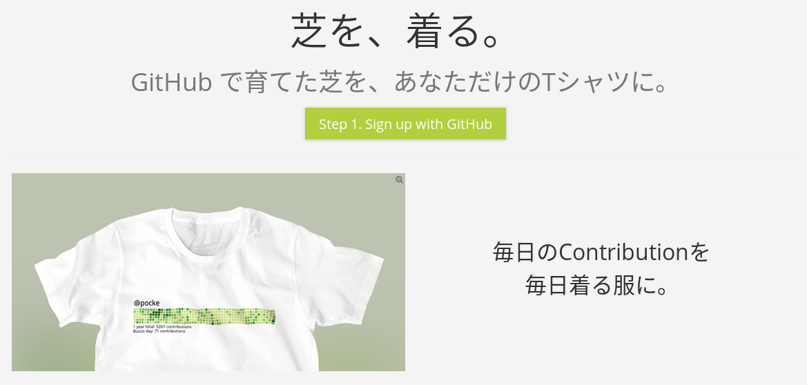
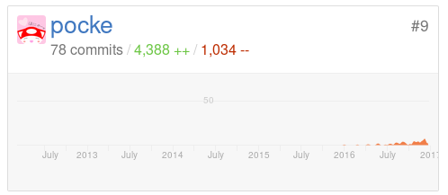

# 実用的な RuboCop の話

[表参道.rb #19 静的解析と技術的負債と……](https://omotesandorb.connpass.com/event/48967/)

---

## 自己紹介

---

### だれこれ


- Pocke ( Masataka Kuwabara )
- Engineer at Actcat Inc.
- RuboCop Contributor
- Student at The Open University of Japan
- TW: [@p\_ck\_](https://twitter.com/p_ck_)  GH: [@pocke](https://github.com)

---

### SideCI


[sideci.com](https://sideci.com)

---

### Shibart



[shibart.pocke.me](https://shibart.pocke.me)

---

### RuboCop Contributor <i class="twa twa-gem"></i>





[Contributors to bbatsov/rubocop](https://github.com/bbatsov/rubocop/graphs/contributors)

---

# 本題

---

## 今日のテーマ

### 「静的解析」「技術的負債」<br>「リファクタリング」とそれから

---

### 話すこと

私はこの中から「静的解析」<br>
にフォーカスして話そうと思います。


---

### テーマ


RuboCop 開発者から見た、<br>
実用的な RuboCop の使い方


---

## Agenda

1. RuboCop とは
  1. RuboCop の機能
  1. RuboCop はそのままでは実用的ではない？
1. 実用的な RuboCop Lint 編
1. 実用的な RuboCop Style 編


---


## 1. RuboCop とは

Q. RuboCop を知っている人？ <i class="twa twa-lg twa-raised-hand"></i>


---

### 1-1 RuboCop の機能


RuboCop は Rubyの静的解析器で、<br>
複数の役割を持っています。

---

### 機能例

- [Ruby Style Guide](https://github.com/bbatsov/ruby-style-guide) に沿ってスタイルチェックを行う Cop
- バグやパフォーマンス上問題のあるコードを検出する Cop
- 複雑すぎるコードを検出する Cop

ちなみに、Cop == 他の Lintでのルール

---


### 例1 Style Checker

```ruby
def foo
  bar+baz            # スペースが足りない
  array.map{|x|bar}  # スペースが足りない
    end              # end の alignment がおかしい
```

- コーディングスタイルの問題を検出する
- 多くの場合、`rubocop -a`で自動修正可能


---

### 例2 Lint / Performance


```ruby
def foo
  if 10 < x < 20       # Ruby ではこのようには書けない
    # ...
  end
  array.sort do |a, b|
    a.foo <=> b.foo    # array.sort_by(&:foo) の方が速い！
  end
end
```

バグやパフォーマンスの問題を検出する

---

### 例3 Metrics

```ruby
def foo                                           # めっちゃ複雑
  if val < 1
  else
    case cond
    when x                                        # めっちゃ長い行
      if (hoge == 1 && fuga == 2) || array.all? { |piyo| piyo <= 3 }
        do_something1
      end
      do_something2
    when y
      do_something3
    else
      do_something4
    end
  end
end
```

複雑すぎるコードを検出する


---

### 1-1 まとめ

- RuboCop を使うと様々な観点からRubyコードの問題点を発見可能
- `-a`オプションを使用することで自動で問題を修正

RuboCop を使えば<br>
Ruby コードに平穏が訪れる…… <i class="twa twa-thinking-face"></i><i class="twa twa-thinking-face"></i>

---


### 1-2 RuboCop の問題点


平穏は訪れない <i class="twa twa-crying-cat-face"></i>

---

### ひたすら大量の警告

SideCIのメインプロダクトで無設定の RuboCop を走らせると、8545個の警告が

```
$ rubocop
....

764 files inspected, 8545 offenses detected
```

<i class="twa twa-2x twa-innocent"></i><i class="twa twa-2x twa-innocent"></i><i class="twa twa-2x twa-innocent"></i>


---

### どのような警告が出るのか<br>調べてみた

```sh
$ rubocop --format json |
  ruby -rjson -e '
    puts JSON[STDIN.read]["files"].map{ |f|
      f["offenses"]}.flatten.map{|x| x["cop_name"]}' |
  sort | uniq -c | sort -nr | head -15
```

---

### 結果(上位15件)

```
2065 Metrics/LineLength
1539 Style/StringLiterals
 762 Style/FrozenStringLiteralComment
 704 Style/AsciiComments
 478 Style/Documentation
 206 Style/IndentHash
 168 Style/NumericLiterals
 157 Metrics/MethodLength
 154 Style/BracesAroundHashParameters
 151 Style/ExtraSpacing
 150 Metrics/AbcSize
 145 Style/ClassAndModuleChildren
 139 Metrics/BlockLength
 110 Style/SpaceInsideBlockBraces
 109 Style/HashSyntax
```

上位15件でもこれだけある… <i class="twa twa-crying-cat-face"></i>

---

### これは全て Metrics or Style 系の Cop

---

### 内訳


Metrics 制限がキツい

- 2065 Metrics/LineLength
  - 1行80文字制限
- 157 Metrics/MethodLength
  - 1メソッドに含まれる行数制限
- 150 Metrics/AbcSize
  - メソッドの複雑さを検出
-  139 Metrics/BlockLength
  - 1ブロックに含まれる行数制限

---

### 内訳

スタイルルールが適してない

- 1539 Style/StringLiterals
  - Single Quotation を強制
-  762 Style/FrozenStringLiteralComment
  - マジックコメントを強制
-  704 Style/AsciiComments
  - コメントにASCII文字を強制
-  478 Style/Documentation
  - クラスにドキュメントコメントを強制

--

### 内訳

続) スタイルルールが適してない

-  206 Style/IndentHash
  - Hashリテラルのインデントスタイルを強制
-  168 Style/NumericLiterals
  - 数値の3ケタで区切りを強制 例) 300_000
-  154 Style/BracesAroundHashParameters
  - メソッド呼び出しの際Hashの括弧を強制
-  151 Style/ExtraSpacing
  - 余分なスペースを検出

--

### 内訳

続) スタイルルールが適してない


-  145 Style/ClassAndModuleChildren
  - ネストしたクラスのスタイルを強制
-  110 Style/SpaceInsideBlockBraces
  - ブロックの括弧の周りにスペースを強制
-  109 Style/HashSyntax
  - Hash Rockeet を使うか強制

---

### 1-2 まとめ

- 大量のエラー原因は以下が多い
  - Style が合わない / キツい
  - Metrics がキツい
- 設定していくにはやっていく気持ちが必要
  - RuboCop の Cop は300個以上ある


---

## 2. MeowCop<i class="twa twa-cat"></i><br>RuboCop を Lint として使う

RuboCop を実用的に使うアプローチの1つ目として、MeowCop を紹介します

---

### 問題点のおさらい

- デフォルト設定では、警告が沢山出る
- 何故ならば
  - Style が合わないから
  - Metrics がキツいから
- いい感じに設定するのは大変

---

### MeowCop とは

「どんなプロジェクトでも使える Cop」<br>
だけを集めた RuboCop の設定


- [sideci/meowcop](https://github.com/sideci/meowcop)
- [RuboCopを使い始めよう！ RuboCop導入に最適な設定、MeowCopをリリースしました！ - SideCI Blog](http://blog-ja.sideci.com/entry/2016/10/03/171816)

---


### 設定のアプローチの方法

- Style系の Cop は概ね無効
  - プロジェクトごとに変えたい設定が多いため
- Metrics 系の Cop はしきい値を緩めに
  - デフォルトはかなりキツい
  - 「この長さ/複雑さはありえない…(体感)」ぐらいを基準に

---

### インストール方法

```sh
$ gem install meowcop
```

```yaml
# .rubocop.yml
inherit_gem:
  meowcop:
    - config/rubocop.yml
```

簡単！ <i class="twa twa-two-hearts"></i>


---

### MeowCopを適用した<br>弊社プロダクトの様子

```
$ rubocop
....

764 files inspected, 245 offenses detected
```

だいぶ平和になった<i class="twa twa-two-hearts"></i>(8545個 -> 245個)

---

### 内訳

```
38 Lint/UselessAssignment               # 未使用変数
37 Metrics/LineLength                   # 200文字以上ある行…
10 Metrics/AbcSize                      # 複雑なメソッド
 9 Metrics/PerceivedComplexity          # 複雑なメソッド
 7 Lint/ParenthesesAsGroupedExpression  # メソッド呼び出しの括弧が適切でない
 5 Style/EachWithObject                 # each_with_object 便利
 5 Metrics/CyclomaticComplexity         # 複雑なメソッド
 4 Style/ParenthesesAroundCondition     # condition に括弧要らない
 3 Lint/ShadowingOuterLocalVariable     # ローカル変数のシャドーイング
 2 Metrics/ParameterLists               # 多すぎる引数
 2 Lint/StringConversionInInterpolation # "a#{foo.to_s}" って無駄だよね
 1 Style/ClassAndModuleCamelCase        # クラスはCamelCaseで
 1 Performance/StringReplacement        # String#gsub より String#tr が速い
```

---

### MeowCop の効能

- Lintがスタイルチェックに埋もれない
- 一般的でないスタイルだけはチェックする(CamelCaseなど)
- Metricsが特に複雑なコードのみを検出


---

## 3. Gry<br>RuboCop を Style Checker として使う

---

### 問題点のおさらい

- デフォルト設定では、警告が沢山出る
- 何故ならば
  - Style が合わないから
  - Metrics がキツいから
- いい感じに設定するのは大変

解決した？ <i class="twa twa-thinking-face"></i>

---

### No!

**Style が合わないから** は、無視しただけ <i class="twa twa-crying-cat-face"></i>

MeowCopによってLintに秩序はもたらされたが、Styleへの秩序はもたらされていない…

---


### Gry とは

「隠れたコーディングスタイルを、`.rubocop.yml`に抽出する」


- [pocke/gry: Gry generates .rubocop.yml automatically](https://github.com/pocke/gry)
- [隠れたコーディングスタイルを .rubocop.yml に抽出するツール、Gryをリリースしました！](http://blog-ja.sideci.com/entry/2017/01/31/110000)


---

### 隠れたコーディングスタイル？ <i class="twa twa-thinking-face"></i>


`.rubocop.yml`になっていなくても、コーディング規約が明示されていなくても、実はソースコードはなんとなく統一されているのでは？

=> それは隠れたコーディングスタイルなのでは！

---

### Gry のアプローチ

- 隠れたコーディングスタイルを抽出して RuboCop の設定に
  - プロジェクトに沿ったStyleの設定が出来る <i class="twa twa-star2"></i>
  - Style Checker として RuboCop を活用できる！


---

### つかいかた

```sh
$ gem install gry
$ gry >> .rubocop.yml
```

簡単！ <i class="twa twa-star2"></i>


---


### やってること

- 全部の設定でとりあえずRuboCopを実行してみる
- 一番警告が少なかった設定がプロジェクトにマッチしてる！


筋肉実装 <i class="twa twa-muscle"></i><i class="twa twa-muscle"></i>

---

### MeowCop との相性

- MeowCop(Lint) と Gry(Style) は直行する概念
  - MeowCop で Lint に集中し、
  - Gry で Style の統一にも取り組む


ふたつを合わせて使えます<i class="twa twa-ok-woman"></i>

---

### 注意事項 <i class="twa twa-warning"></i>

- Gry はまだ未完成
  - 「Lintの設定はこうあるべき」という姿を示しただけ
  - まだ設定できる項目はあるはず
  - もっと賢い戦略で採用する設定を決められるはず
  - まだ Gry の真の力は現れていない…！
- あくまで「既存コードに合ったルール」
  - 実際にルールを採用する際は、人間が見たほうがよさそう

---


## まとめ


- 生でRuboCopを使うのはたいへん
- [MeowCop](https://github.com/sideci/meowcop) を使うと、RuboCopをLintとして使える
- [Gry](https://github.com/pocke/gry) を使うと、RuboCopを最適化されたスタイルチェッカとして使える


ご清聴ありがとうございました。
