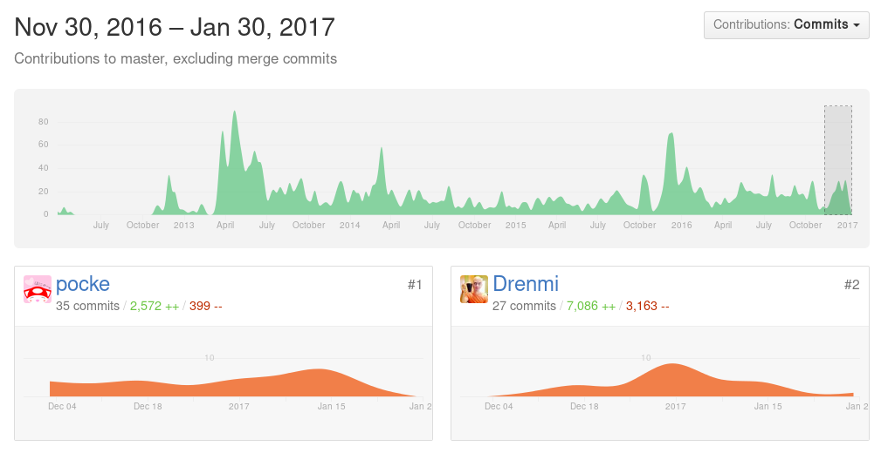

# 実用的な RuboCop の話

[表参道.rb #19 静的解析と技術的負債と……](https://omotesandorb.connpass.com/event/48967/)

---

## こんにちは

---

## 自己紹介

---


- Pocke ( Masataka Kuwabara )
- Engineer at Actcat Inc.
- RuboCop Contributor
- TW: @p\_ck\_  GH: @pocke

---

## RuboCop Contributor ?

---

9番目にコミットが多かったり…


[Contributors to bbatsov/rubocop](https://github.com/bbatsov/rubocop/graphs/contributors)

---

ここ2ヶ月だと一番コミットしていたりします



[Contributors to bbatsov/rubocop](https://github.com/bbatsov/rubocop/graphs/contributors?from=2016-11-30&to=2017-01-30&type=c)


---

主にLint関連のルールを追加したり、バグ修正をしていることが多いです。

- [Performance/RegexpMatch](https://github.com/bbatsov/rubocop/pull/3824)
- [Lint/SafeNavigationChain](https://github.com/bbatsov/rubocop/pull/3804)
- [Lint/MultipleCompare](https://github.com/bbatsov/rubocop/pull/3795)
- などなど

---


そんな RuboCop 開発者が思う、実用的な RuboCop の使い方について話します。


---

## Agenda

1. RuboCop とは
  1. 概略
  1. つらい点
1. 実用的な RuboCop Lint 編
1. 実用的な RuboCop Style 編


---


## 1. RuboCop とは

---

Q. RuboCop を知っている人？ <i class="twa twa-lg twa-raised-hand"></i>


---

### 1-1 RuboCop の概略

---


RuboCop は Rubyの静的解析器で、<br>
複数の役割を持っています。

- [Ruby Style Guide](https://github.com/bbatsov/ruby-style-guide) に沿ってスタイルチェックを行う
- バグやパフォーマンス上問題のあるコードを検出する
- 複雑すぎるコードを検出する


---


### 例1 Style Checker

```ruby
def foo
  bar+baz            # スペースが足りない
  array.map{|x|bar}  # スペースが足りない
    end              # end の alignment がおかしい
```

コーディングスタイルの問題を検出する


---

### 例2 Lint / Performance


```ruby
def foo
  if 10 < x < 20       # Ruby ではこのようには書けない
    # ...
  end
  array.sort do |a, b|
    a.foo <=> b.foo    # array.sort_by(&:foo) の方が速い！
  end
end
```

バグやパフォーマンスの問題を検出する

---

### 例3 Metrics

```ruby
def foo                                           # めっちゃ複雑
  if val < 1
  else
    case cond
    when x                                        # めっちゃ長い行
      if (hoge == 1 && fuga == 2) || array.all? { |piyo| piyo <= 3 }  
        do_something1
      end
      do_something2
    when y
      do_something3
    else
      do_something4
    end
  end
end
```

複雑すぎるコードを検出する


---


### 1-2 RuboCop の問題点


---


## 2. MeowCop / RuboCop を Lint として使う


---

## 3. Gry / RuboCop を Style Checker として使う

---

## まとめ
